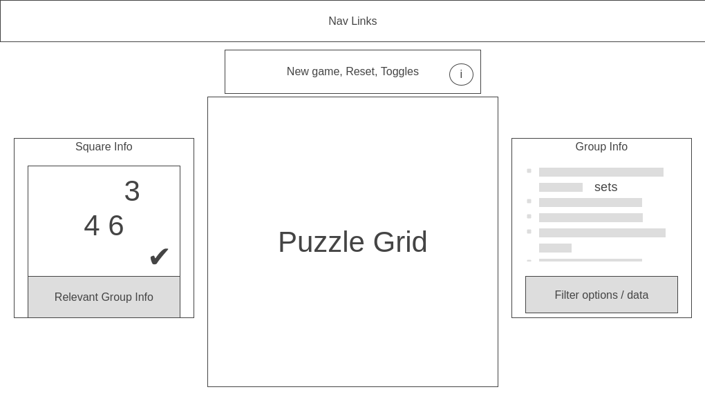

## Background and Overview 

Arithmedoku is inspired by the popular puzzle game [KenKen][1], a sudoku-like game
with a math twist.

What will set Arithmedoku apart from other remakes of KenKen is its advanced annotation and deduction tools. 

The fun of paper puzzles is how easily you can create your own systems of annotation and sketch out your reasoning. Digital versions struggle in that regard. You end up just trying to remember more and notate less, which makes solving the puzzle less fun and more difficult.

## Functionality and MVPs 

1. Puzzles render appropriately. Player can reset puzzle, or choose to generate a new puzzle. Player can input numbers into `squares`. Players are notified when they win.
2. `Squares`: 
* Players can navigate `squares` via keyboard.
* An infobox appears for the selected `square` on the left. Players can annotate numbers which they think could be in the `square`. Players can check a box indicating that they've listed every possible number the `square` could contain. Only then do the numbers appear in the actual `square` inside the puzzle. 
* When auto eliminate option is turned on, a number be entered somewhere else in the `square`'s row / column will eliminate that number from the `square`'s possible numbers.
3. Groups: 
* By default, every `cage` forms a `group`: a collection of `squares` that are logically connected. Selecting a `square` causes the `group` info box for its `cage` to appear on the right. Here, players can choose numbers that *must* appear in the cage or *can't* appear in the grid. 
* Players can list every possible `set` of numbers that could appear in the `cage`, and auto compute whether that implies any numbers must appear or can't appear. 
* If auto-calculate is turned on, player can auto-generate the list of all possible numbers that could appear in the `cage`.
4. `Implications`: 
* For any possible number in a `square` or `set` in a `group`, player can create an implication: essentially, the domino effect of choosing that number or set. 
* Then, during the normal course of the game, if the player ends up choosing that number or `set`, they get prompted that they had an implication set up, and whether they want to instantly trigger all those domino effects they had figured out before. The domino effects are all listed, and any numbers that would be added to the puzzle appear in the puzzle in a different color. Hit tab to trigger, any other key to ignore.

## Wireframe 

## Architecture and Technology 
* Vanilla JavaScript
* Sass
* Webpack

## Implementation Timeline 

### Day 1
* manually type up a core set of puzzles from free source, figure out how to best format it
* MVP one: render puzzles, basic input on squares and win conditions, reset / new

### Day 2
* style the puzzle nicely
* get the info boxes done with core functionality of choosing possible numbers, finalizing those, listings sets, must contain and can't contain numbers, etc

### Day 3
* style the info boxes nicely, add some extra non functional info: relevant group info in square info box, numbers that appear in almost every or almost no set in group
* ensure perfect keyboard interaction; shortcut to trigger modify number possibility
* get the core functionality of implications done

### Day 4
* finish implications
* style and polish, add gh links, instructions / info boxes

## (Bonus Features) 

1. `Groups` that aren't cages. Drag or shift and select multiple squares, create sets / must include numbers / can't include numbers for those squares. Scrollable cards of info when one square is associated with multiple `groups`. 
2. `Partitions`: a more abstract set of exhaustive possibilities than possible numbers in a `square` or possible `sets` in a `group`. Essentially, you're just stating that 
3. `Notepad`: a kind of central hub of info at the bottom of the puzzle, where you can see a list of every `implication`, `partition`, or custom `group` you've made, and where you can jot down general notes and thoughts.
4. Timed puzzles, different difficulties, high scores.

[1]: https://en.wikipedia.org/wiki/KenKen